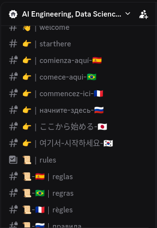

# Discord Cam Kick Bot

A small bot that enforces *camera-on* rules in specific Discord voice channels.

It watches a voice channel, gives users a short grace period, and removes anyone who stays without a camera on.
Useful for communities, study groups, or moderated servers where cam presence is required.

---

## Features

* Detects users joining without a camera
* 20-second grace period
* Moves (kicks) users who stay cam-off
* Optional whitelist roles
* Fully configurable through `.env`
* Activity + security logs
* Can run as a `systemd` service for auto-start and recovery

---

## Bot Instances

This repo powers **two separate bots**:

* **Production bot** – runs on my main community server
* **Demo bot** – runs on a public test server for recruiters/devs

Both use the same code but run with **different tokens**, **different configs**, **different servers**.

Production invite:
[https://discord.com/oauth2/authorize?client_id=1394511324431646870&permissions=17894400&integration_type=0&scope=bot](https://discord.com/oauth2/authorize?client_id=1394511324431646870&permissions=17894400&integration_type=0&scope=bot)

---

## Demo Server

Public demo: **[https://discord.gg/XRrC8EPsnC](https://discord.gg/XRrC8EPsnC)**

The demo exists only to showcase the bot — nothing else.
No onboarding, no extra channels, no rules. Just join, enter the cam-only channel, and see the bot act.

How to test it:

1. Join the voice channel
2. Don’t enable your camera
3. Wait ~20 seconds
4. The bot will move you out and send you a message

---

## Main Server (screenshots below)

The production bot runs on a full community server currently under construction:

* multilingual onboarding
* role-based access
* camera-on channels
* categories for data science, AI, engineering
* structured permissions
* professional layout

*(Server is private while being built.)*


<div style="display: flex; justify-content: space-around; align-items: flex-start;">
  
  
  
</div>

---

## Run This Bot on Your Server

You can deploy your own instance easily:

1. Create a Discord Application
2. Add a Bot to it
3. Grab your bot token
4. Create a `.env` file
5. Install dependencies
6. Run normally or via `systemd`

The architecture is intentionally simple so anyone can host it safely.

---

## Installation (Developers)

1. Clone:

```
git clone https://github.com/celsomsilva/discord-cam-kick-bot.git
cd discord-cam-kick-bot
```

2. Optional virtual env:

```
python3 -m venv venv
source venv/bin/activate
```

3. Install:

```
pip install -r requirements.txt
```

4. Configure `.env`:

```
TOKEN=your_bot_token
CHANNEL_ID=voice_channel_id
WHITELIST_ROLE_IDS=comma_separated_roles
```

5. Run:

```
python3 bot.py
```

---

## systemd Service

Copy service file:

```
sudo cp discordbot.service /etc/systemd/system/
```

Enable and start:

```
sudo systemctl daemon-reexec
sudo systemctl enable discordbot
sudo systemctl start discordbot
```

Logs:

```
journalctl -u discordbot -f
```

---

## Project Structure

```
discord-cam-kick-bot/
 bot.py
 .env.example
 requirements.txt
 discordbot.service
 logs/
    activity.log
    security.log
 README.md
```

---

## Security

* Secrets stored in `.env`
* No hardcoded tokens
* Respects Discord role hierarchy
* Separate activity/security logs


## Author

This project was developed by an engineer and data scientist with a background in:

* Postgraduate degree in **Data Science and Analytics (USP)**
* Bachelor's degree in **Computer Engineering (UERJ)**
* Special interest in statistical models, interpretability, and applied AI

---

## Contact  

- [LinkedIn](https://linkedin.com/in/celso-m-silva)  
- Or open an [issue](https://github.com/celsomsilva/discord-cam-kick-bot/issues) 
